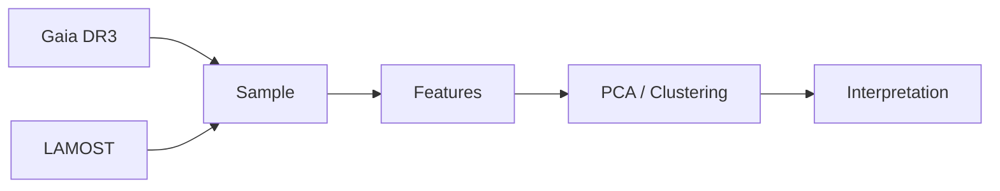

<div align="center">

# Lior Linho

**Physics × Scientific Computing × Data-driven Astronomy**

Building research-oriented software with real scientific datasets.

[Website](https://lior-linho.github.io/) ·
[GitHub](https://github.com/lior-linho) ·
[LinkedIn](https://www.linkedin.com/in/lior-l-05b4322a7)

</div>

---



---

## Featured Research Line

**Data-driven Galactic Archaeology with Gaia DR3 and LAMOST**

```text
Gaia DR3 + LAMOST
        ↓
cross-matched stellar sample
        ↓
chemo-kinematic feature space
        ↓
PCA · clustering · diagnostics
        ↓
candidate Galactic substructures
```

[Repository →](https://github.com/lior-linho/gaia-lamost-galactic-archaeology)

---

## Current Focus

```yaml
fields:
  - physics
  - astrophysics
  - scientific computing

methods:
  - astronomical survey analysis
  - machine learning for scientific data
  - research software development

tools:
  - Python
  - Jupyter
  - Git
```

---

## Projects

| Project                              | Direction                                                     |
| ------------------------------------ | ------------------------------------------------------------- |
| **Gaia–LAMOST Galactic Archaeology** | Large-scale astronomical survey data analysis                 |
| **OpenMed**                          | Medical simulation software with interactive 3D visualization |
| **Learning Atlas**                   | Public learning archive for CS, math, physics, and astronomy  |

---

<div align="center">

`Python` · `NumPy` · `Pandas` · `Matplotlib` · `Scikit-learn` · `Jupyter`
`Astropy` · `ADQL` · `React` · `TypeScript` · `Three.js`

<br/>

> Toward the intersection of physics, computation, and data-driven research.

</div>
